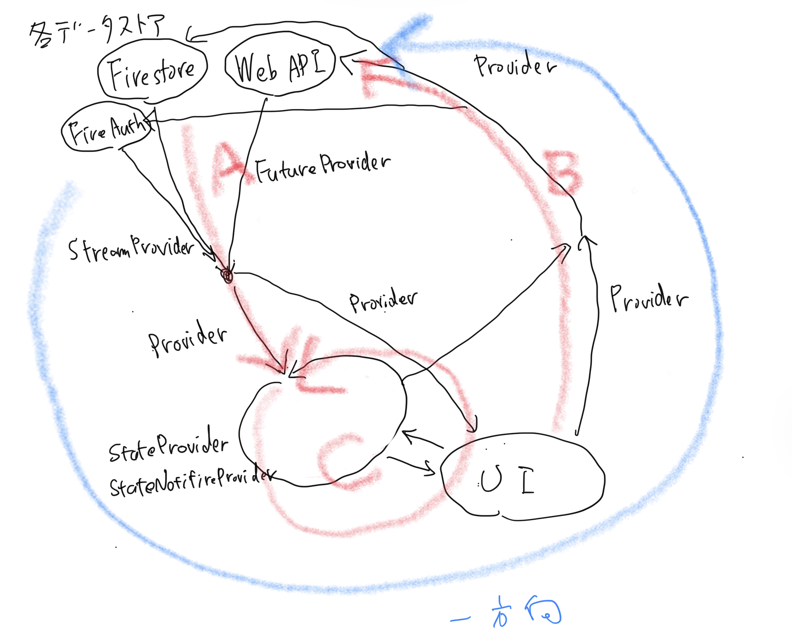
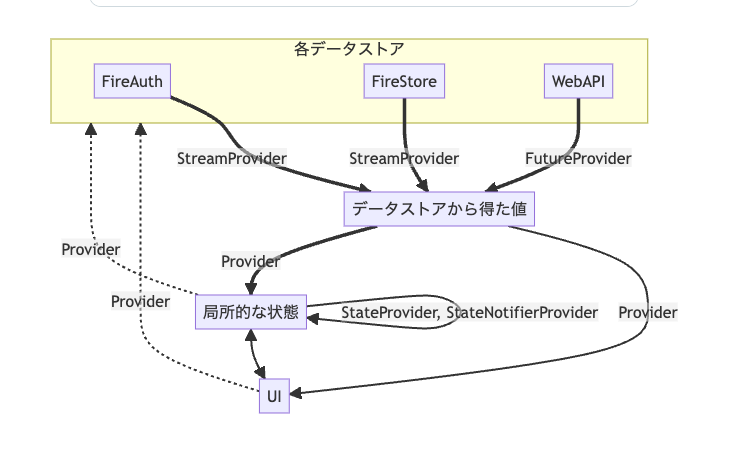

# Flutter-Better-Practice

## 一般的な Flutter アプリケーション設計

ここでの「一般的なモバイルアプリ」は規模観点では以下程度のイメージですが、それを超えるような規模でも通ずる内容も多いと思っています。

コード量: 数万〜十数万行
実装者: 一桁人
種類としては(スマホ向けの)クライアントアプリコードであり、以下などではないです。

パッケージ・ライブラリではない
サーバーサイドではない
この種類によって適切な組み方はけっこう変わり、アプリコードは依存関係の末端側(基本的に依存される側にはならない)なこともあり、比較的アバウトに組んで良い(雑なコードで良いという意味ではない)と思っています。また、一部の特殊なアプリでは例外的にあてはまらない内容も多少あるかもしれません(95%以上はあてはまる内容だろうとは思っています)。

## 疑わしい作り

例えば、以下のような感じで、Flutter プロジェクトとしては不自然な回りくどい作りになっていたり、本当に必要かどうか疑わしいようなレイヤーが挟まってたりと思うことがあります。

以前の(Flutter 以外の)プロジェクトを踏襲して MVVM 採用しよう
Clean Architecture・Domain Driven Design(DDD)について調べたら、このレイヤーを挟むと良いらしいので、そのまま導入しよう
結果的にそれがある程度うまくハマることもあるかもしれませんが、闇雲に様々なパターンを取り入れず、まずは Flutter において必ず守るべき基本原則をしっかり抑えて、さらに本当に必要な設計要素を適宜足し算で合わせていく方が過不足ないプロジェクトコードになると考えています。

## Flutter における基本原則

- Single Source of Truth(SSOT)原則に従った状態管理
- 状態の流れを単方向データフローで組む

次点で以下(上の 2 点ほど遵守必須ではないが大抵守る方が良い)だと思っています。

- immutable プログラミングの徹底
- Unit/Widget Test が可能に
- 単一責任の原則を意識

これらさえきちんと満たして型セーフにお行儀良く組んでいれば、大抵は凝った工夫せずとも自然と及第点は満たす作りになってくる印象です(要件の複雑度に応じて適宜工夫は必要になりますが一般的なアプリではシンプルに済むところも多いと思います)。逆にこの基本を疎かにしながら、「MVVM 採用」「Clean Architecture 遵守」などと何となく掲げても、無駄に冗長だったりごちゃごちゃした歪な作りになりがちに思います。

## Single Source of Truth(SSOT)原則に従った状態管理

`信頼できる唯一の情報源 (Single Source of Truth; SSOT) とは、情報システムの設計と理論においては、すべてのデータが1か所でのみ作成、あるいは編集されるように、情報モデルと関連するデータスキーマとを構造化する方法である。データへのリンクで可能なものは参照のみである。プライマリ以外の他の場所のすべてのデータは、プライマリの「信頼できる情報源」の場所を参照するだけであり、プライマリのデータが更新された場合、どこかで重複したり失われたりすることなく、システム全体に伝播される。`

https://ja.wikipedia.org/wiki/%E4%BF%A1%E9%A0%BC%E3%81%A7%E3%81%8D%E3%82%8B%E5%94%AF%E4%B8%80%E3%81%AE%E6%83%85%E5%A0%B1%E6%BA%90

SSOT を正しく意識できている場合、例えば以下のようなよくある要件を満たしたい時、特別な工夫なく容易かつ確実に実現できるはずです。

記事一覧画面で、自分の like 表示がされている(未 like)
詳細画面に遷移後、like するとその詳細画面で like 済みに変わる
一覧画面に戻ると、その記事が like 済みになっている
この際、SSOT になってない場合は以下のように脆い状態になります:

- 一覧画面と詳細画面の記事データソースが別管理(同じ記事のインスタンスが 2 つ存在)
- 詳細画面の記事インスタンスの like を true に変更(この時点では一覧画面のその記事インスタンスは未 like)
- 一覧画面の記事インスタンスにも like 済みであることを同期(ここに抜け漏れがあるとバグったり、あるいは概ね正しく組んでいてもその処理が煩雑になりがちだったり一時的に表示不整合が生じるなどしがち)
- 同期処理完了後、一覧でも like 済みになる

## SSOT を満たしたコード例(Riverpod 利用)

```import 'package:flutter/material.dart';
import 'package:flutter_riverpod/flutter_riverpod.dart';
import 'package:freezed_annotation/freezed_annotation.dart';

part 'example.freezed.dart';

final articlesProvider = StateNotifierProvider<ArticlesNotifier, List<Article>>(
  (ref) => ArticlesNotifier(),
);

// SSOTを満たした、記事データソース
class ArticlesNotifier extends StateNotifier<List<Article>> {
  ArticlesNotifier()
      : super(List.generate(10, (index) => Article(id: '$index')));

  void like(String id) {
    final index = state.indexWhere((article) => article.id == id);
    final article = state[index];
    state = List.of(state)
      ..[index] = article.copyWith(
        isLiked: true,
      );
  }
}

@freezed
class Article with _$Article {
  const factory Article({
    required String id,
    @Default(false) bool isLiked,
  }) = _Article;
  const Article._();
}
```

## 利用側では、以下のように一覧・詳細ともにその同一のデータソースを参照・操作します:

```// 一覧画面
class ArticleListView extends ConsumerWidget {
  const ArticleListView({super.key});
  @override
  Widget build(BuildContext context, WidgetRef ref) {
    final articles = ref.watch(articlesProvider);
    return ListView(
      children: [
        for (final article in articles) Text('$article'),
      ],
    );
  }
}

// 詳細画面
class ArticleDetailView extends ConsumerWidget {
  const ArticleDetailView({
    super.key,
    required this.id,
  });

  final String id;
  @override
  Widget build(BuildContext context, WidgetRef ref) {
    final article = ref.watch(
      articlesProvider.select(
        (articles) => articles.firstWhere((article) => article.id == id),
      ),
    );
    return TextButton(
      child: Text('$article'),
      onPressed: () {
        ref.read(articlesProvider.notifier).like(id);
      },
    );
  }
}
```

一覧と詳細での表示不整合が絶対に生じ得ない作りになっていることが分かるはずです。もちろん、一覧と詳細で都合の良いデータ構造が異なりそれぞれ加工が必要なこともありますが、その場合でも大元の SSOT なデータソースから派生させる作りにすることがポイントです。

## 上の例はローカルに閉じた簡易コードですが、Firestore を使う場合は次のようなコードになります:

```import 'package:cloud_firestore/cloud_firestore.dart';
import 'package:flutter/material.dart';
import 'package:flutter_riverpod/flutter_riverpod.dart';
import 'package:freezed_annotation/freezed_annotation.dart';

part 'example.freezed.dart';

final articlesRefProvider = Provider<CollectionReference<Article>>(
  (ref) => FirebaseFirestore.instance.collection('articles').withConverter(
        fromFirestore: (snapshot, options) =>
            Article.fromJson(snapshot.data()!..['id'] = snapshot.id),
        toFirestore: (article, options) => article.toJson()..remove('id'),
      ),
);

// データソース
final articlesProvider = StreamProvider<List<Article>>(
  (ref) => ref
      .watch(articlesRefProvider)
      .snapshots()
      .map((snap) => snap.docs.map((doc) => doc.data()).toList()),
);

// like操作のためのProvider
final articleLikeServiceProvider = Provider(ArticleLikeService.new);

class ArticleLikeService {
  ArticleLikeService(this._ref);

  final Ref _ref;
  void like(String id) {
    _ref.read(articlesRefProvider).doc(id).update({'isLiked': true});
  }
}

// 一覧画面
class ArticleListView extends ConsumerWidget {
  const ArticleListView({super.key});
  @override
  Widget build(BuildContext context, WidgetRef ref) {
    final articles = ref.watch(articlesProvider).value ?? [];
    return ListView(
      children: [
        for (final article in articles) Text('$article'),
      ],
    );
  }
}

// 詳細画面
class ArticleDetailView extends ConsumerWidget {
  const ArticleDetailView({
    super.key,
    required this.id,
  });

  final String id;
  @override
  Widget build(BuildContext context, WidgetRef ref) {
    final article = ref.watch(
      articlesProvider.select(
        (articles) => articles.value!.firstWhere((article) => article.id == id),
      ),
    );
    return TextButton(
      child: Text('$article'),
      onPressed: () {
        ref.read(articleLikeServiceProvider).like(id);
      },
    );
  }
}
```

Firestore の場合は、それ自体( FirebaseFirestore.instance )が SSOT とみなせるので、上のように必ずしも同じ Provider 参照せずとも以下でも良いです。

```// データソース
final articleProviderFamily = StreamProvider.family<Article, String>(
  (ref, id) => ref
      .watch(articlesRefProvider)
      .doc(id)
      .snapshots()
      .map((doc) => doc.data()!),
);

// 詳細画面からの参照
final article = ref.watch(articleProviderFamily(id));
```

## Riverpod の各 Provider の主要な利用箇所と流れ

- A: 各データストアから得た値をリアクティブなキャッシュとして流す(参照だけのアプリならこれだけで済む)
- B: UI からの入力を元にデータストアを更新(そういうメソッドを持つクラスあるいはクロージャーを返す Provider)



